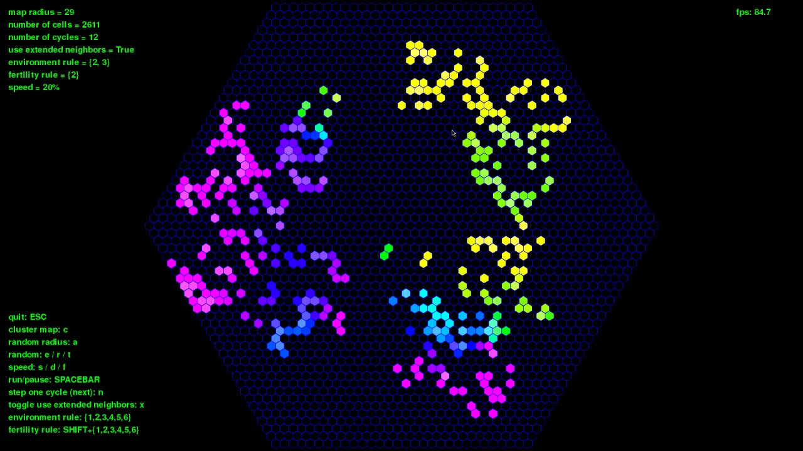

# hexgame
Hexagonal Game Of Life

This is a mini implementation of a game of life variation with hexagonal cells.
It is written in Python (and pygame for rendering).
This code was mostly written as an excuse to learn more about Python, and the performance
of the language. So you will not find here your gem for a game of life. For a powerful engine, look instead at [Golly](http://golly.sourceforge.net/).

